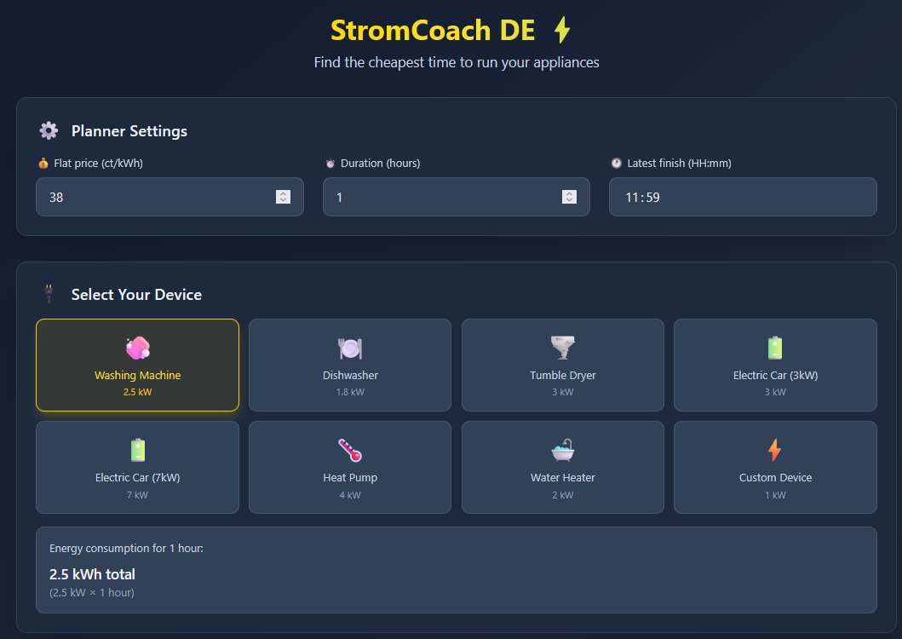
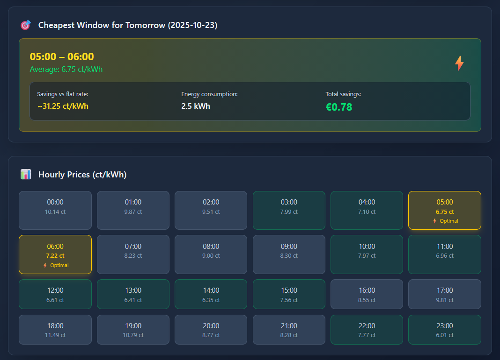

# StromCoach DE ⚡

StromCoach DE is a smart web application that helps German electricity consumers save money by finding the cheapest time windows to run their appliances. It analyzes dynamic electricity tariffs and calculates optimal scheduling for high-consumption devices.

## What it does

The app fetches real-time electricity prices for Germany (DE-LU region) and finds the most cost-effective continuous time slot based on your specific needs:

- **Input**: Your flat electricity rate, appliance duration, and deadline
- **Output**: Cheapest time window with potential savings
- **Goal**: Maximize savings on your electricity bill

## Screenshot




## Features

-  **Real-time Price Data**: Fetches tomorrow's hourly electricity prices from Energy Charts API
-  **Customizable Planning**: Set your flat rate, appliance duration, and deadline
-  **Savings Calculator**: Shows exact savings compared to your flat rate
-  **Hourly Overview**: Displays all 24 hours of pricing data
-  **Persistent Settings**: Remembers your preferences in localStorage

##  How it works

1. **Data Fetching**: Server-side API route fetches prices from `api.energy-charts.info`
2. **CORS Bypass**: Next.js API route acts as proxy to avoid browser restrictions
3. **Algorithm**: Sliding window algorithm finds cheapest continuous time period
4. **Optimization**: Considers duration, deadline, and price variations
5. **Results**: Shows time window, average price, and potential savings

## Technologies Used

- **Next.js 15** - React framework with API routes
- **React 19** - Frontend UI library
- **TypeScript** - Type-safe JavaScript
- **Tailwind CSS** - Utility-first styling
- **Energy Charts API** - Real-time electricity pricing data

## Project Structure

```
stromcoach-web/
├── src/
│   ├── app/
│   │   ├── api/tomorrow-prices/
│   │   │   └── route.ts          # API proxy for electricity data
│   │   ├── page.tsx              # Main application UI
│   │   ├── layout.tsx            # App layout wrapper
│   │   └── globals.css           # Global styles
│   └── lib/
│       ├── getTomorrowPrices.ts  # Client-side API calls
│       ├── cheapestWindow.ts     # Core optimization algorithm
│       └── aggregateToHours.ts   # Data processing utilities
├── package.json                  # Dependencies and scripts
└── README.md                     # This file
```

##  Getting Started

### Prerequisites
- Node.js 18+ 
- npm or yarn

### Installation

1. **Clone the repository:**
   ```bash
   git clone https://github.com/ahmed-babay/stromcoach-web.git
   cd stromcoach-web
   ```

2. **Install dependencies:**
   ```bash
   npm install
   ```

3. **Run the development server:**
   ```bash
   npm run dev
   ```

4. **Open your browser:**
   Navigate to [http://localhost:3000](http://localhost:3000)

## 📖 How to Use

1. **Set your flat rate**: Enter your current electricity price (e.g., 30 ct/kWh)
2. **Choose duration**: How long does your appliance need to run? (e.g., 3 hours)
3. **Set deadline**: When must it finish? (e.g., 07:00 AM)
4. **View results**: See the cheapest time window and potential savings

### Example Use Cases

- **Washing Machine**: 3 hours, finish by 7 AM
- **Dishwasher**: 2 hours, finish by 10 PM  
- **EV Charging**: 6 hours, finish by 6 AM
- **Heat Pump**: 4 hours, finish by 8 AM

## 🔧 API Details

The app uses the Energy Charts API (`api.energy-charts.info`) which provides:
- Real-time electricity prices for Germany/Luxembourg
- Hourly granularity
- Day-ahead pricing
- Historical data
